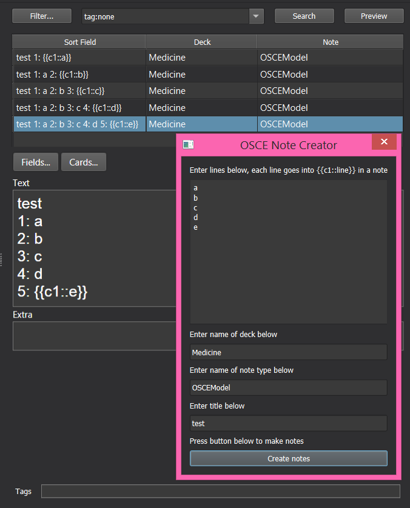

# Anki enumeration tool

This add-on adds a special note creation window to Anki that can be used to quickly create cards that together constitute an enumeration. For more information and installation instructions, please refer to the [add-on page](https://ankiweb.net/shared/info/268751365).

